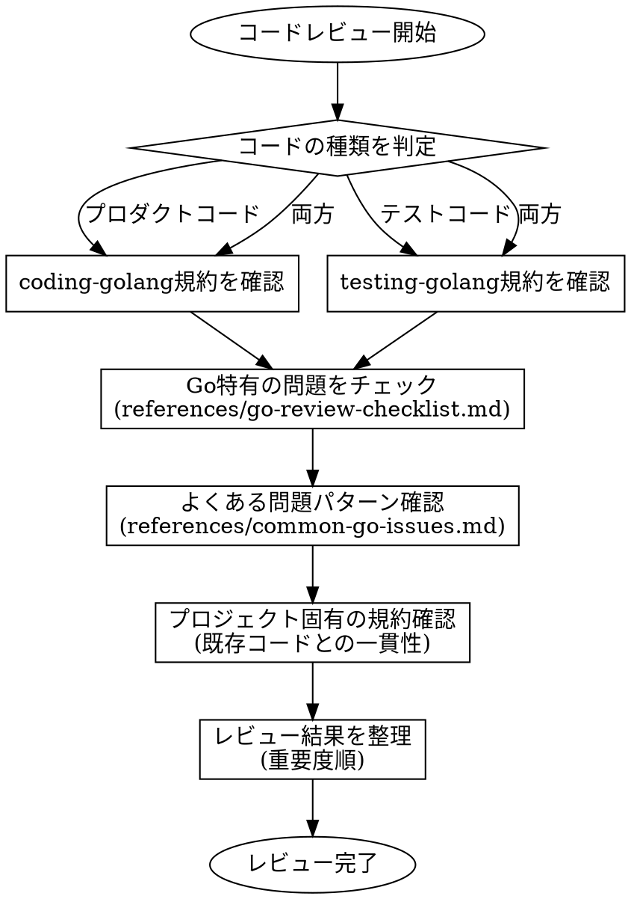

# Go Code Reviewer (reviewing-golang)

## Overview

Go特有の観点でコードレビューを行うスキル。プロダクトコード・テストコード両方に対応し、coding-golangとtesting-golangスキルの規約に準拠しているかも確認する。

## 関連スキルへの参照

| スキル | 確認内容 |
|--------|----------|
| **coding-golang** | プロダクトコードの規約（chi、GORM、エラーハンドリング等） |
| **testing-golang** | テストコードの規約（testify、mockery、テーブル駆動テスト等） |

**REQUIRED:** レビュー対象がプロダクトコードなら coding-golang、テストコードなら testing-golang の規約に準拠しているか確認すること。

## レビューフロー



## レビュー観点

### 1. Go特有の問題（最重要）

詳細は [go-review-checklist.md](references/go-review-checklist.md) を参照。

| カテゴリ | 確認項目 |
|----------|----------|
| **ゴルーチン安全性** | リーク、無制限生成、競合状態 |
| **チャネル** | デッドロック、クローズ忘れ、nil送受信 |
| **リソース管理** | Close()呼び出し、defer使用、コネクションプール |
| **エラーハンドリング** | 無視されたエラー、rows.Err()、ラッピング |
| **コンテキスト** | 伝播、キャンセル対応、タイムアウト |
| **同期** | Mutex unlock漏れ、WaitGroup誤用、sync.Once |

### 2. よくある問題パターン

詳細は [common-go-issues.md](references/common-go-issues.md) を参照。

- ループ変数のキャプチャ
- nilインターフェース vs nil値
- time.Afterのリーク
- 空スライス vs nilスライス

### 3. コード品質

- 命名規則（Go慣習に従っているか）
- 関数の単一責任
- 早期リターン
- マジックナンバーの回避

### 4. テストコード（該当する場合）

- テーブル駆動テストの使用
- assert/requireの適切な使い分け
- エッジケースのカバー
- モックの適切な使用

### 5. セキュリティ

- SQLインジェクション
- 入力バリデーション
- 機密情報の扱い

## 必須チェックリスト

レビュー時に以下を必ず確認すること：

### Critical（必ず確認）

- [ ] sql.Rows, sql.Conn, http.Response.Body などがClose()されているか
- [ ] ゴルーチンが適切に終了するか（リーク防止）
- [ ] Mutexのunlockがすべてのパスで保証されているか
- [ ] エラーが無視されていないか
- [ ] コンテキストが適切に伝播されているか

### High（重要）

- [ ] チャネル操作でデッドロックの可能性がないか
- [ ] 並行処理でデータ競合がないか
- [ ] for loop内でのtime.After使用がないか
- [ ] nilインターフェースのチェックが正しいか

### Medium

- [ ] HTTP Clientにタイムアウトが設定されているか
- [ ] deferの実行順序が意図通りか
- [ ] エラーに適切なコンテキストが付与されているか

## 出力フォーマット

レビュー結果は以下の形式で整理すること：

```markdown
## レビュー結果

### Critical Issues
- [行番号] 問題の説明と修正案

### High Priority
- [行番号] 問題の説明と修正案

### Medium Priority
- [行番号] 問題の説明と修正案

### Suggestions
- 改善提案

### 確認事項
- coding-golang/testing-golang 規約への準拠: [OK/要修正]
- プロジェクト固有の規約: [OK/要修正/未確認]
```

## リファレンス一覧

| ファイル | 内容 |
|----------|------|
| [go-review-checklist.md](references/go-review-checklist.md) | Go特有のレビュー観点詳細 |
| [common-go-issues.md](references/common-go-issues.md) | よくある問題パターンと修正例 |
